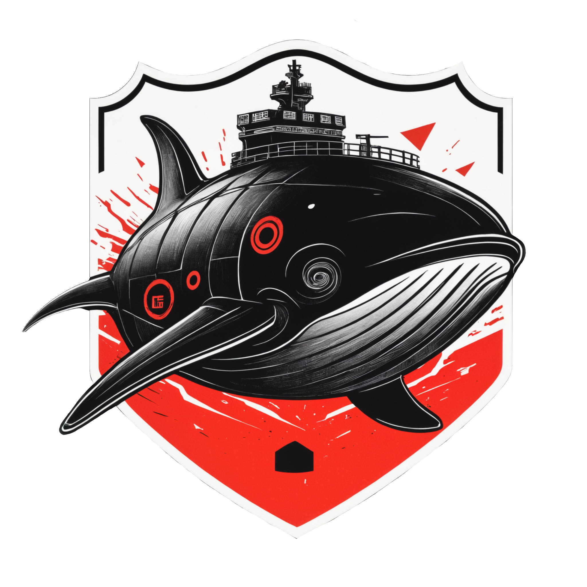

<h1 align="center">
  <br>
  </a>
  <br>Containerized Security Toolkit (CST)<br>
</h1>

<p align="center">
    <a href="https://tanishq.page/blog/posts/cst-guide/"><b>Companion Blog</b></a>  &bull;  
    <a href="https://hub.docker.com/r/tanq16/sec_docker"><b>Docker Hub</b></a><br>
    <a href="https://github.com/tanq16/containerized-security-toolkit/actions/workflows/sec-build.yml"></a>
    <a href="https://github.com/tanq16/containerized-security-toolkit/actions/workflows/sec-build-arm.yml"></a>
</p>

<br>

This project contains two Dockerfiles for a multi-stage image build that results in an ARM (useful for Apple Silicon) or x86_64 variants of a security focused docker image &rarr;

- **Security Image for x86_64**
- **Security Image for ARM64**

The image is built automatically on via CI/CD pipelines and pushed to Docker Hub. The image is called `sec_docker` and it presents multiple tags &rarr;

| | x86\_64 | ARM |
| --- | --- | --- |
| tag | `main` | `main_apple` |
| image ref | `tanq16/sec_docker:main` | `tanq16/sec_docker:main_apple` |

It has the [cli-productivity-suite](https://github.com/tanq16/cli-productivity-suite) preinstalled within the image. The [companion blog post](https://tanishq.page/blog/posts/cst-guide/) goes over using the pre-built image, building it with modifications, conventions considered when creating the Dockerfiles, and different ways it can be used.

---

For a quick look into the container and its capabilities, built from this image, is as follows &rarr; 

```bash
docker run --name="sec_docker_quickstart" --rm -it tanq16/sec_docker:main /bin/zsh
```

It is also recommended to run the following command (replace with your timezone in second line) after getting into the container &rarr;

```bash
export TERM=xterm-256color && \
echo "America/Chicago" > /etc/timezone && rm -rf /etc/localtime && \
ln -s "/usr/share/zoneinfo/$(cat /etc/timezone)" /etc/localtime
```

If you exit the shell, the container will be destroyed along with the information in the ephemeral filesystem. I recommend reading the [companion blog post](https://tanishq.page/blog/posts/cst-guide/) for a better workflow

There are several other nuances related to running the container, such as &rarr;

- setting up a persistence diretcory across container restarts
- using one-word shell functions to start and stop containers with customized settings
- connecting to the container via SSH
- dynamic port-forwarding over SSH to access container-local services

All of the above nuances are comprehensively explained in the [companion blog post](https://tanishq.page/blog/posts/cst-guide/), especially the *Example Workflow* section.
